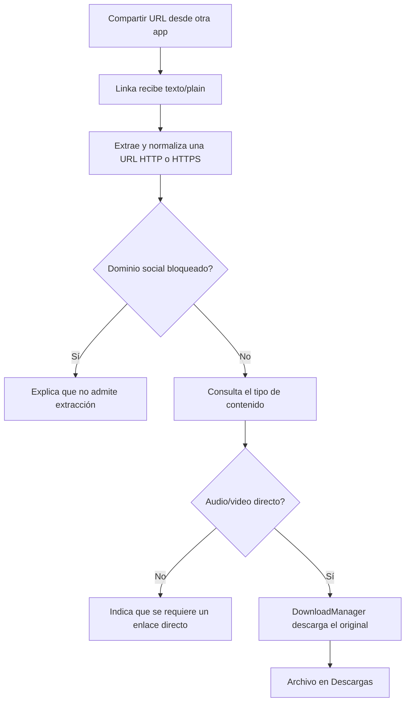

# Linka

[](https://github.com/rikiluciano/Linka/actions/workflows/android.yml)
[](https://github.com/rikiluciano/Linka/releases/latest)

**Linka** es una aplicación Android personal que convierte el flujo de compartir un enlace en una forma sencilla de guardar un archivo multimedia directo y autorizado para verlo o escucharlo sin conexión.

El proyecto explora una necesidad común: un enlace compartido puede llevar a un archivo descargable, a una página web o a una plataforma que no entrega el archivo original. Linka distingue el caso compatible, explica los demás y delega la transferencia al gestor de descargas de Android.

> **Alcance actual:** Linka descarga el archivo original cuando el enlace apunta directamente a audio o video accesible. No extrae ni convierte contenido de YouTube, Instagram, Facebook u otros servicios.

## Problema y valor

Al recibir un enlace, el usuario normalmente debe averiguar qué tipo de recurso contiene, copiarlo a otra herramienta y encontrar dónde quedó el archivo. Las páginas y los reproductores web tampoco siempre representan una dirección directa al medio.

Linka reúne ese flujo en una aplicación Android que aparece en el menú **Compartir**. La app analiza la dirección, confirma si detecta un archivo de audio o video y, si es compatible, inicia la descarga en la carpeta pública **Descargas**. Android gestiona la transferencia y su notificación.

El valor del MVP está en un flujo pequeño, nativo y transparente: no requiere cuenta, backend propio ni permisos generales de almacenamiento; informa al usuario cuando el enlace no es un archivo directo y conserva el formato y la calidad de la fuente.

## Qué hace

- Recibe texto o enlaces compartidos desde otras aplicaciones Android.
- Permite pegar un enlace manualmente y analizarlo.
- Comprueba el tipo de contenido mediante una petición HTTP `HEAD`; si el servidor no admite ese método, prueba una petición `GET` limitada al primer byte.
- Reconoce respuestas `audio/*` y `video/*` y extensiones directas habituales: `.mp3`, `.m4a`, `.aac`, `.mp4`, `.webm` y `.mov`.
- Rechaza enlaces de YouTube, Instagram y Facebook con una explicación y sugiere usar las opciones oficiales del servicio.
- Descarga el archivo original en `Descargas` con `DownloadManager`, que administra la transferencia en Android.
- Presenta el tipo de medio detectado y deja claro que la calidad y el formato dependen del archivo fuente.

## Qué no hace

- No extrae streams ni resuelve páginas de reproducción de plataformas sociales.
- No inicia sesión en servicios externos, usa cookies del usuario ni elude controles de acceso.
- No convierte entre MP3, MP4 u otros formatos y no transcodifica resoluciones.
- No ofrece selección HD/UHD: solo puede conservar la calidad que entrega el enlace directo.
- No incluye navegador propio, biblioteca de descargas, reproductor ni backend.

Estas limitaciones definen el alcance actual y evitan prometer funciones que el MVP no implementa. Descarga únicamente archivos propios o para los que tengas autorización.

## Cómo funciona



1. Android muestra Linka como destino para compartir texto (`text/plain`).
2. Linka localiza la URL, elimina puntuación final común y comprueba el dominio.
3. La app consulta el servidor del enlace para detectar el MIME type. Ejecuta la red en un `ExecutorService`, no en el hilo de interfaz.
4. Si reconoce audio o video, habilita **Descargar archivo original**.
5. `DownloadManager` descarga el recurso a `Environment.DIRECTORY_DOWNLOADS` y muestra la notificación de finalización del sistema.

## Requisitos y compatibilidad

- Android Studio compatible con Android Gradle Plugin 9.4.0.
- JDK 17.
- Gradle 9.6.0.
- Android SDK Platform 37 para compilar.
- Android 10 (API 29) o posterior para instalar; `minSdk` es 29 y `targetSdk` es 36.
- Un dispositivo o emulador Android para validar la experiencia real.

La compilación de GitHub Actions instala JDK y Gradle automáticamente. El proyecto no incluye Gradle Wrapper; CI usa Gradle 9.6.0 configurado en el workflow.

## Abrir y compilar

1. Clona el repositorio y ábrelo en Android Studio.
2. Instala Android SDK Platform 37 cuando el IDE lo solicite.
3. Sincroniza Gradle con JDK 17.
4. Ejecuta la configuración `app` o la tarea `assembleDebug`.

Desde una terminal que tenga Android SDK configurado también puedes ejecutar:

```bash
gradle --no-daemon assembleDebug
```

El APK local se genera en `app/build/outputs/apk/debug/app-debug.apk`.

## Descargar e instalar

El APK de la versión estable más reciente está en [GitHub Releases](https://github.com/rikiluciano/Linka/releases/latest). También puedes [descargar directamente `linka.apk`](https://github.com/rikiluciano/Linka/releases/latest/download/linka.apk).

El artefacto de GitHub Actions se conserva durante 30 días; el archivo adjunto a un Release permanece disponible hasta que se elimine ese Release. El APK del Release es de depuración y está firmado con la clave de depuración de CI. Para distribuir la app fuera del uso personal se debe configurar una clave de firma de lanzamiento protegida y almacenada fuera del repositorio.

Para usarla, abre un enlace multimedia directo en otra app, elige **Compartir**, selecciona **Linka**, espera el análisis y pulsa **Descargar archivo original**. También puedes pegar la dirección directamente en Linka. Si el enlace abre una página HTML o una plataforma no compatible, Linka explicará que necesita una URL directa al archivo.

## Privacidad y permisos

La app declara el permiso `INTERNET` para consultar y descargar la dirección que introduce o comparte el usuario. La comunicación se realiza directamente desde el dispositivo al servidor de esa URL; el proyecto no incluye un servicio remoto de Linka, cuentas, anuncios, analítica ni registro propio de enlaces. `DownloadManager` guarda el archivo en la carpeta pública Descargas.

Se admiten enlaces HTTP y HTTPS en el MVP. Prefiere HTTPS y verifica que confías en la dirección antes de iniciar una descarga. El nombre del archivo se deriva del último segmento de la URL y se restringe a caracteres seguros comunes.

## Estructura del proyecto

```text
Linka/
├── .github/workflows/android.yml   # Compila APK en cada push y publica Releases por etiqueta
├── app/
│   ├── build.gradle                # ID, versiones, SDKs y opciones de Java
│   └── src/main/
│       ├── AndroidManifest.xml     # Permiso INTERNET, launcher y destino de compartir
│       ├── java/com/rikiluciano/linka/MainActivity.java
│       └── res/
│           ├── drawable/ic_linka.xml
│           └── values/{strings,styles}.xml
├── build.gradle                    # Versión del Android Gradle Plugin
├── gradle.properties              # Opciones de Gradle y AndroidX
├── settings.gradle                # Repositorios y módulos
├── sync-to-github.sh              # Commit, push y versión automática en el servidor
├── publish-linka.ps1              # Publicador de un solo comando desde Windows
├── CODEX.md                       # Guía técnica y operativa para agentes y colaboradores
└── README.md
```

## Publicar cambios y una nueva versión

El publicador de Windows sincroniza los archivos del proyecto con el servidor, ejecuta allí el commit y push a `main`, incrementa automáticamente el parche semántico (`v1.0.0` → `v1.0.1`), aumenta `versionCode`, crea la etiqueta y refresca este clon desde GitHub.

Desde PowerShell, en esta carpeta, utiliza un solo comando:

```powershell
.\publish-linka.ps1 -Message "Improve direct media detection"
```

La estación debe tener OpenSSH (`ssh`/`scp`) y un alias `serveras` autorizado para la carpeta del proyecto. El acceso SSH y su clave privada son configuración del servidor/equipo; nunca deben añadirse al repositorio. Los colaboradores sin ese acceso pueden proponer cambios mediante un fork y un pull request.

Una publicación inicia dos comprobaciones de GitHub Actions: una compilación del APK para el commit de `main` y otra compilación de la etiqueta. Al finalizar la segunda, GitHub crea el Release y adjunta `linka.apk`. Si no hay cambios, el script no crea commit, versión ni Release.

El servidor tiene además el comando de bajo nivel para cambios que ya se copiaron allí:

```bash
cd /home/ricardo/proyects/Linka
./sync-to-github.sh "Update Linka" --release
```

La versión de la app y la etiqueta del Release se mantienen sincronizadas automáticamente. Los Releases anteriores y sus APKs constituyen el historial de versiones.

## Calidad y estado

- El workflow verifica que `assembleDebug` compile y publica un artefacto descargable.
- Las etiquetas `vMAJOR.MINOR.PATCH` crean Releases con el APK adjunto.
- La validación en dispositivo físico/emulador sigue siendo necesaria para revisar el selector Compartir, los servidores de archivos reales y las notificaciones del sistema.
- No hay suite de pruebas automatizadas de la lógica Android en esta primera versión.

## Guía para contribuir

Lee [CODEX.md](CODEX.md) antes de modificar el código: documenta la arquitectura, rutas, decisiones, comandos y flujo de publicación. Mantén explícita la diferencia entre enlaces directos y páginas de plataformas. Toda función nueva debe actualizar la documentación y pasar por la compilación de CI.
