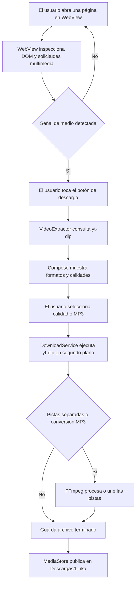

# Linka

[](https://github.com/rikiluciano/Linka/actions/workflows/android.yml)
[](https://github.com/rikiluciano/Linka/releases/latest)
[](LICENSE)

**Linka** es una aplicación Android de navegación y descarga de medios. Integra un navegador basado en WebView con yt-dlp para analizar páginas compatibles, mostrar formatos disponibles y descargar video o audio con calidad configurable. FFmpeg une las pistas separadas cuando la fuente entrega video y audio por separado.

Linka es un proyecto personal, sin anuncios, cuentas ni backend propio. Su objetivo es reunir en el teléfono el recorrido de encontrar contenido, revisar las opciones y guardar el archivo para verlo o escucharlo sin conexión.

> Descarga únicamente material propio, de dominio público, con licencia adecuada o para el que tengas autorización. Linka no elimina DRM, no salta controles de acceso y no inicia sesión ni importa cookies por ti. La disponibilidad depende de cada sitio y puede cambiar cuando sus páginas o políticas cambian.

## El problema que resuelve

Un enlace compartido suele llevar a una página de reproducción, no al archivo multimedia en sí. Eso obliga a cambiar entre navegador, herramientas de terceros y gestores de archivos, y a veces no permite elegir la resolución o separar el audio.

Linka reúne esas tareas en una interfaz Android: navegas a una página, la app detecta señales de video, analizas la dirección con yt-dlp, eliges una calidad o formato y sigues el trabajo en una notificación del sistema. Los archivos terminados aparecen en **Descargas/Linka**.

## Funciones

- Navegador integrado con barra de dirección para páginas HTTP y HTTPS.
- Entrada de una URL compartida desde otra app Android.
- Detección de elementos de video del DOM y solicitudes multimedia comunes (`mp4`, `m3u8`, `mpd` y audio/video directo).
- Extracción de título y formatos disponibles con el wrapper Android de yt-dlp.
- Selección automática de la mejor calidad disponible, elección de formato de video y extracción de audio MP3.
- Descarga de flujos de video y audio separados y combinación mediante FFmpeg cuando el formato y el extractor lo permiten.
- Servicio en primer plano para mantener visible una descarga iniciada por el usuario, con notificación de porcentaje, velocidad estimada y estado de finalización.
- Publicación del archivo completado en `Descargas/Linka` mediante `MediaStore`, compatible con almacenamiento con ámbito de Android 10 o posterior.
- Tema oscuro, sin publicidad, analítica, cuentas ni servidor Linka.

## Límites y compatibilidad

- yt-dlp admite muchos sitios, pero no existe garantía de que una página concreta sea compatible. Los extractores y los formatos dependen del sitio y de la versión incluida en la librería.
- La detección del navegador es heurística. Detectar un reproductor o una solicitud multimedia no garantiza que yt-dlp pueda analizar esa página.
- Los sitios que exigen inicio de sesión, cookies, verificación anti-bot, fingerprint especial, contenido DRM o permisos del propietario no son compatibles con esta configuración. Linka no intenta evadir esas restricciones.
- La aplicación no obtiene credenciales ni reutiliza sesiones del WebView para yt-dlp.
- La descarga y la conversión dependen de la conectividad, el espacio disponible, los códecs y los límites del proveedor.
- La calidad máxima depende de las opciones que la fuente ofrezca a la herramienta. MP3 requiere conversión con FFmpeg.
- Se solicita permiso de notificaciones al iniciar una descarga en Android 13 o posterior. Si se deniega, el sistema puede ocultar la notificación habitual.
- La librería `youtubedl-android` integra software GPL-3.0. Este proyecto se distribuye bajo GPL-3.0; consulta [LICENSE](LICENSE) y conserva los avisos de terceros.
- La versión CI actual produce un APK debug-signed; no sustituye una firma de distribución protegida para una publicación en Play Store.

## Flujo técnico



1. `MainActivity` inicia Compose y acepta `ACTION_SEND` o `ACTION_VIEW` con una dirección web.
2. `BrowserView` carga la página. El detector inspecciona los recursos multimedia solicitados y consulta etiquetas de video con `evaluateJavascript` de solo lectura. No expone un puente `JavascriptInterface` a páginas arbitrarias.
3. El botón aparece cuando hay una señal. Solo al tocarlo se ejecuta `VideoExtractor.inspect()` en IO y se consultan los formatos.
4. `LinkaViewModel` mantiene la dirección, la página detectada, los formatos y los errores en `StateFlow`.
5. `DownloadService` se inicia como servicio en primer plano, ejecuta yt-dlp fuera del hilo principal y actualiza el porcentaje. Un monitor del archivo temporal estima kB/s; el progreso puede variar entre extractores.
6. yt-dlp llama a FFmpeg para combinar pistas o extraer MP3. Linka copia el resultado a `MediaStore.Downloads` y lo deja en `Descargas/Linka`.

## Tecnologías

- Kotlin y Jetpack Compose con arquitectura MVVM ligera.
- `StateFlow` y corrutinas para estado y trabajo fuera del hilo principal.
- Android WebView para navegación.
- `io.github.junkfood02.youtubedl-android:library:0.18.1` y el módulo `ffmpeg` para análisis y descarga.
- Servicio Android en primer plano y `MediaStore` para finalización y almacenamiento.
- Android Gradle Plugin 9.4, JDK 17, `compileSdk 37`, `targetSdk 36` y `minSdk 29`.

## Estructura

```text
Linka/
├── .github/workflows/android.yml
├── app/src/main/
│   ├── AndroidManifest.xml
│   ├── java/com/rikiluciano/linka/
│   │   ├── LinkaApplication.kt       # Inicializa yt-dlp y FFmpeg
│   │   ├── MainActivity.kt           # Host de Compose y enlaces compartidos
│   │   ├── download/DownloadService.kt
│   │   ├── extractor/                # Formatos, calidades, yt-dlp
│   │   └── ui/                       # Compose, ViewModel y BrowserView
│   └── res/                          # Icono y recursos Android
├── app/build.gradle
├── CODEX.md                          # Contexto técnico detallado
├── LICENSE                           # GPL-3.0
├── publish-linka.ps1                 # Publicación de un solo comando
└── sync-to-github.sh                 # Versionado y Release desde el servidor
```

## Compilar e instalar

1. Abre el repositorio en Android Studio compatible con AGP 9.4 y JDK 17.
2. Sincroniza Gradle y espera la descarga inicial de las dependencias nativas; el APK de desarrollo será considerablemente mayor que el MVP anterior porque incorpora Python/yt-dlp y FFmpeg.
3. Compila `:app:assembleDebug` o ejecuta **Build > Build APK(s)**.
4. Instala `app/build/outputs/apk/debug/app-debug.apk` en un dispositivo Android 10 o posterior.
5. Navega a una página compatible, espera el indicador, toca el botón de descarga y elige una calidad. Autoriza notificaciones si quieres ver el progreso en el panel del sistema.

La compilación CI adjunta `linka.apk` a cada Release creado por una etiqueta `v*`. Descarga la última versión desde [GitHub Releases](https://github.com/rikiluciano/Linka/releases/latest).

## Publicación del proyecto

Desde PowerShell, en la raíz del clon, el flujo configurado sincroniza los archivos al servidor, allí crea el commit, incrementa `versionCode` y `versionName`, empuja `main` y la etiqueta a GitHub. La etiqueta inicia la compilación y el Release del APK:

```powershell
.\publish-linka.ps1 -Message "Describe el cambio"
```

Requiere Git, OpenSSH y el alias SSH `serveras` configurado localmente. Nunca agregues tokens, claves privadas, contraseñas FTP, keystores o archivos `local.properties` al repositorio.

## Privacidad y uso responsable

El procesamiento se ejecuta en el dispositivo. Linka no tiene backend propio ni guarda un historial de URLs. El WebView y yt-dlp hacen solicitudes de red a las direcciones que abre o analiza el usuario. No importamos cookies del WebView ni guardamos credenciales de sitios. El navegador permite páginas HTTPS y HTTP, pero se recomienda HTTPS.

Las reglas de cada plataforma y los derechos de autor siguen aplicando aunque el uso sea personal. En particular, revisa las condiciones del sitio y descarga solo cuando tengas autorización. [Términos de YouTube](https://www.youtube.com/t/terms) · [Políticas para desarrolladores de YouTube](https://developers.google.com/youtube/terms/developer-policies-guide?hl=es-419).

## Contribuir

Lee [CODEX.md](CODEX.md) antes de modificar la arquitectura. Mantén el detector separado del extractor; no habilites interfaces JS arbitrarias, almacenamiento de cookies, evasión de DRM o controles de acceso. Documenta nuevas dependencias, licencias y permisos. El flujo CI compila el APK en cada push y publica Releases versionados desde etiquetas.
