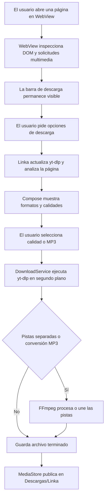

# Linka

[](https://github.com/rikiluciano/Linka/actions/workflows/android.yml)
[](https://github.com/rikiluciano/Linka/releases/latest)
[](LICENSE)

**Linka** es una aplicación Android para navegar y guardar contenido multimedia y archivos. Integra un navegador basado en WebView con yt-dlp para analizar páginas compatibles, mostrar formatos disponibles y descargar video o audio con calidad configurable. También guarda el archivo original de un enlace HTTP(S) directo (por ejemplo, imagen, PDF, hoja de cálculo o documento) mediante el gestor nativo de descargas de Android. FFmpeg une las pistas separadas cuando la fuente entrega video y audio por separado.

Linka es un proyecto personal, sin anuncios, cuentas ni backend propio. Su objetivo es reunir en el teléfono el recorrido de encontrar contenido, revisar las opciones y guardar el archivo para verlo o escucharlo sin conexión.

> Descarga únicamente material propio, de dominio público, con licencia adecuada o para el que tengas autorización. Linka no elimina DRM, no salta controles de acceso y no inicia sesión ni importa cookies por ti. La disponibilidad depende de cada sitio y puede cambiar cuando sus páginas o políticas cambian.

## El problema que resuelve

Un enlace compartido suele llevar a una página de reproducción, no al archivo multimedia en sí. Eso obliga a cambiar entre navegador, herramientas de terceros y gestores de archivos, y a veces no permite elegir la resolución o separar el audio.

Linka reúne esas tareas en una interfaz Android: navegas a una página, la app detecta señales de video, analizas la dirección con yt-dlp, eliges una calidad o formato y sigues el trabajo en una notificación del sistema. Los archivos terminados aparecen en **Descargas/Linka**.

## Funciones

- Navegador integrado con barra de dirección para páginas HTTP y HTTPS.
- Entrada de una URL compartida desde otra app Android.
- Descarga directa de imágenes, documentos y otros tipos de archivo servidos por un enlace HTTP(S), sin convertirlos ni restringirlos a una lista de extensiones. Android administra la transferencia en segundo plano y Linka los guarda en `Descargas/Linka`.
- Detección de elementos de video del DOM y solicitudes multimedia comunes (`mp4`, `m3u8`, `mpd` y audio/video directo).
- Extracción de título y formatos disponibles con el wrapper Android de yt-dlp; antes de analizar o descargar, Linka comprueba y actualiza yt-dlp desde el canal estable de GitHub.
- Selección automática de la mejor calidad disponible, elección de formato de video y extracción de audio MP3.
- Selector de video separado del audio: agrupa variantes por resolución, presenta cada altura real disponible (por ejemplo 480p, 720p, 1080p, 1440p, 2160p o 4320p) y omite las que el origen no ofrece. Linka nunca etiqueta una fuente 480p como 1080p ni inventa resolución.
- Exportación a MP3 con el ajuste V0 de FFmpeg y la mejor pista de audio que la fuente permita. La conversión prioriza calidad perceptual, pero no puede recuperar detalle que ya se perdió en el archivo original.
- Descarga de flujos de video y audio separados y combinación mediante FFmpeg cuando el formato y el extractor lo permiten.
- Servicio en primer plano para mantener visible una descarga iniciada por el usuario, con notificación de porcentaje, velocidad estimada y estado de finalización.
- Publicación del archivo completado en `Descargas/Linka` mediante `MediaStore`, compatible con almacenamiento con ámbito de Android 10 o posterior.
- Descarga directa de recursos con `DownloadManager`: sigue redirecciones HTTP(S) y muestra la notificación del sistema. El nombre local deriva del path de la URL y se hace único para evitar colisiones.
- Tema oscuro, sin publicidad, analítica, cuentas ni servidor Linka.
- Comprobación asíncrona de nuevas versiones al abrir Linka, aviso para aceptar o posponer, descarga del APK en almacenamiento privado y verificación SHA-256, paquete y firma antes de instalar.
- Instalación mediante `PackageInstaller` de Android. El sistema solicita autorización para permitir instalaciones desde Linka si todavía no se concedió, y muestra la confirmación final para reemplazar la versión instalada.

## Límites y compatibilidad

- Android requiere que el usuario confirme la instalación en su interfaz del sistema. Para migrar desde una versión firmada con una clave debug/efímera, puede hacer falta desinstalarla una vez e instalar el primer APK con la clave estable; las actualizaciones futuras conservarán esa firma.
- Este actualizador está pensado para la distribución directa del APK durante el uso personal. Antes de publicar Linka en Google Play, se debe retirar el autoactualizador con `REQUEST_INSTALL_PACKAGES` y usar el flujo de actualizaciones de Google Play; la política de Play restringe usar ese permiso para actualizar la propia app.

- yt-dlp admite muchos sitios, pero no existe garantía de que una página concreta sea compatible. Los extractores y los formatos dependen del sitio y de la versión actualizada de yt-dlp.
- La detección del navegador es heurística. La barra para buscar opciones permanece visible aunque el detector no encuentre un reproductor; esto tampoco garantiza que yt-dlp pueda analizar esa página.
- Los sitios que exigen inicio de sesión, cookies, verificación anti-bot, fingerprint especial, contenido DRM o permisos del propietario no son compatibles con esta configuración. Linka no intenta evadir esas restricciones.
- La aplicación no obtiene credenciales ni reutiliza sesiones del WebView para yt-dlp.
- La descarga y la conversión dependen de la conectividad, el espacio disponible, los códecs y los límites del proveedor.
- La calidad máxima depende de las opciones que la fuente ofrezca a la herramienta. MP3 requiere conversión con FFmpeg.
- La descarga directa guarda exactamente la respuesta del enlace abierto. Debe ser la URL del archivo/recurso; si se pega la URL de una página, se descargará su respuesta (habitualmente HTML), no se extraerán automáticamente imágenes o adjuntos. No se importan cookies ni credenciales del navegador: un recurso privado o que exige sesión puede responder con error. Se acepta cualquier extensión o tipo de contenido porque se guardan bytes sin conversión.
- Se solicita permiso de notificaciones al iniciar una descarga en Android 13 o posterior. Si se deniega, el sistema puede ocultar la notificación habitual.
- La librería `youtubedl-android` integra software GPL-3.0. Este proyecto se distribuye bajo GPL-3.0; consulta [LICENSE](LICENSE) y conserva los avisos de terceros.
- Los APK de `main` son de depuración. Los Releases `v*` se firman con una clave privada estable guardada en secretos de GitHub Actions; conserva una copia de respaldo privada, ya que perderla impide actualizar las instalaciones existentes.

## Flujo técnico



1. `MainActivity` inicia Compose y acepta `ACTION_SEND` o `ACTION_VIEW` con una dirección web.
2. `BrowserView` carga la página. El detector inspecciona los recursos multimedia solicitados y consulta etiquetas de video con `evaluateJavascript` de solo lectura. No expone un puente `JavascriptInterface` a páginas arbitrarias.
3. La barra de descarga queda visible cuando hay una página abierta. Al tocarla, Linka actualiza yt-dlp desde el canal estable de GitHub e invoca `VideoExtractor.inspect()` en IO para consultar formatos.
4. `LinkaViewModel` mantiene la dirección, la página detectada, el estado de actualización, los formatos, el resultado de la descarga y los errores en `StateFlow`.
5. `DownloadService` se inicia como servicio en primer plano, intenta actualizar yt-dlp y ejecuta el motor fuera del hilo principal. Un monitor del archivo temporal estima kB/s; el progreso puede variar entre extractores. Los fallos concisos aparecen en la notificación y dentro de Linka.
6. yt-dlp llama a FFmpeg para combinar pistas o extraer MP3. Linka copia el resultado a `MediaStore.Downloads` y lo deja en `Descargas/Linka`.
7. Al abrirse, `LinkaViewModel` consulta el endpoint público de releases en IO sin bloquear la interfaz. Si encuentra una versión nueva, `LinkaScreen` pregunta antes de descargar. `AppUpdateService` mantiene la descarga del APK en primer plano y lo guarda en caché privada. Verifica el digest SHA-256 publicado por GitHub, el `applicationId`, el `versionCode` y el certificado.
8. `AppInstaller` escribe el APK en una sesión de `PackageInstaller`. Android puede pedir habilitar "Permitir instalar apps" para Linka y luego presenta su propia confirmación para sustituir la app.

## Tecnologías

- Kotlin y Jetpack Compose con arquitectura MVVM ligera.
- `StateFlow` y corrutinas para estado y trabajo fuera del hilo principal.
- Android WebView para navegación.
- `io.github.junkfood02.youtubedl-android:library:0.18.1` y el módulo `ffmpeg` para análisis y descarga.
- Servicio Android en primer plano y `MediaStore` para finalización y almacenamiento.
- Android Gradle Plugin 9.4, JDK 17, `compileSdk 37`, `targetSdk 36` y `minSdk 29`.

## Estructura

```text
Linka/
├── .github/workflows/android.yml
├── app/src/main/
│   ├── AndroidManifest.xml
│   ├── java/com/rikiluciano/linka/
│   │   ├── LinkaApplication.kt       # Inicializa yt-dlp y FFmpeg
│   │   ├── MainActivity.kt           # Host de Compose y enlaces compartidos
│   │   ├── download/DownloadService.kt
│   │   ├── extractor/                # Formatos, calidades, yt-dlp
│   │   ├── update/                   # Releases, descarga privada e instalador Android
│   │   └── ui/                       # Compose, ViewModel y BrowserView
│   └── res/                          # Icono y recursos Android
├── app/build.gradle
├── CODEX.md                          # Contexto técnico detallado
├── AGENT_HANDOFF.md                  # Traspaso portable para agentes y colaboradores
├── LICENSE                           # GPL-3.0
├── publish-linka.ps1                 # Publicación de un solo comando
└── sync-to-github.sh                 # Versionado y Release desde el servidor
```

## Compilar e instalar

1. Abre el repositorio en Android Studio compatible con AGP 9.4 y JDK 17.
2. Sincroniza Gradle y espera la descarga inicial de las dependencias nativas; el APK de desarrollo será considerablemente mayor que el MVP anterior porque incorpora Python/yt-dlp y FFmpeg.
3. Compila `:app:assembleDebug` o ejecuta **Build > Build APK(s)**.
4. Instala `app/build/outputs/apk/debug/app-debug.apk` en un dispositivo Android 10 o posterior.
5. Navega o comparte un enlace. **Elegir descarga** analiza formatos de video/audio para seleccionar resolución o MP3. **Descargar archivo o imagen del enlace** guarda directamente el archivo servido por esa dirección. La primera comprobación de actualizaciones necesita internet. Autoriza notificaciones si quieres ver el progreso multimedia en el panel del sistema; Android administra las notificaciones de la descarga directa.

Los pushes a `main` producen un APK de depuración. Cada etiqueta `v*` produce un APK de Release firmado y lo adjunta al release. La publicación firmada requiere los secretos `LINKA_RELEASE_KEYSTORE_BASE64`, `LINKA_KEYSTORE_PASSWORD`, `LINKA_KEY_ALIAS` y `LINKA_KEY_PASSWORD` en GitHub Actions. Descarga la última versión desde [GitHub Releases](https://github.com/rikiluciano/Linka/releases/latest).

## Publicación del proyecto

Desde PowerShell, en la raíz del clon, el flujo configurado sincroniza los archivos al servidor, allí crea el commit, incrementa `versionCode` y `versionName`, empuja `main` y la etiqueta a GitHub. La etiqueta inicia la compilación y el Release del APK:

```powershell
.\publish-linka.ps1 -Message "Describe el cambio"
```

Requiere Git, OpenSSH y el alias SSH `serveras` configurado localmente. Nunca agregues tokens, claves privadas, contraseñas FTP, keystores o archivos `local.properties` al repositorio.

## Privacidad y uso responsable

El procesamiento se ejecuta en el dispositivo. Linka no tiene backend propio ni guarda un historial de URLs. El WebView y yt-dlp hacen solicitudes de red a las direcciones que abre o analiza el usuario. No importamos cookies del WebView ni guardamos credenciales de sitios. El navegador permite páginas HTTPS y HTTP, pero se recomienda HTTPS.

Las reglas de cada plataforma y los derechos de autor siguen aplicando aunque el uso sea personal. En particular, revisa las condiciones del sitio y descarga solo cuando tengas autorización. [Términos de YouTube](https://www.youtube.com/t/terms) · [Políticas para desarrolladores de YouTube](https://developers.google.com/youtube/terms/developer-policies-guide?hl=es-419).

## Contribuir

Lee [CODEX.md](CODEX.md) antes de modificar la arquitectura. Mantén el detector separado del extractor; no habilites interfaces JS arbitrarias, almacenamiento de cookies, evasión de DRM o controles de acceso. Documenta nuevas dependencias, licencias y permisos. El flujo CI compila el APK en cada push y publica Releases versionados desde etiquetas.
